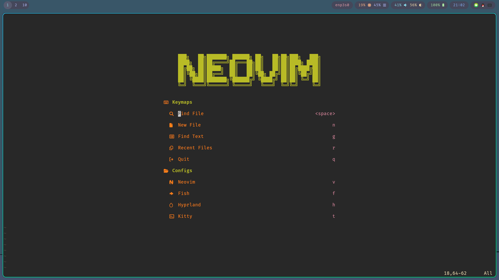
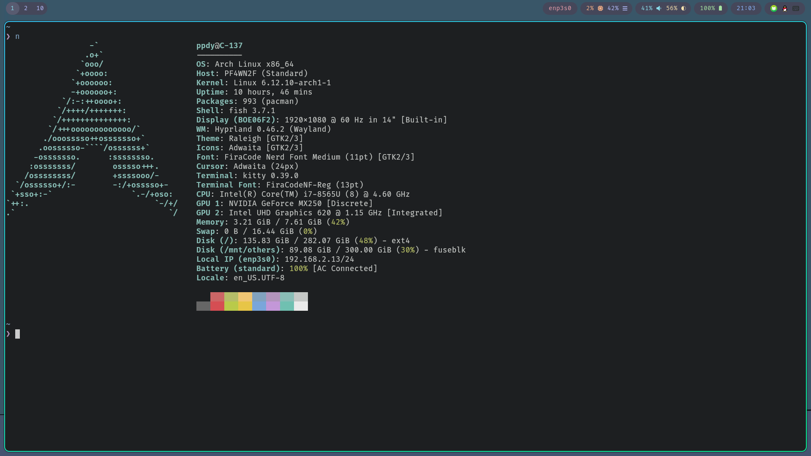
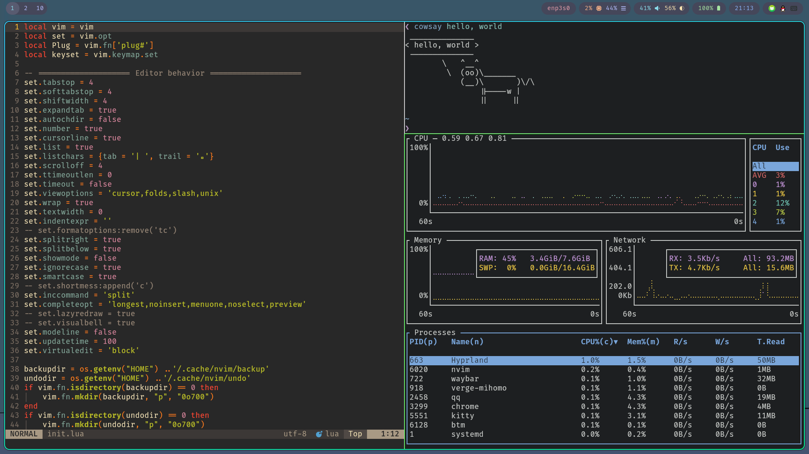
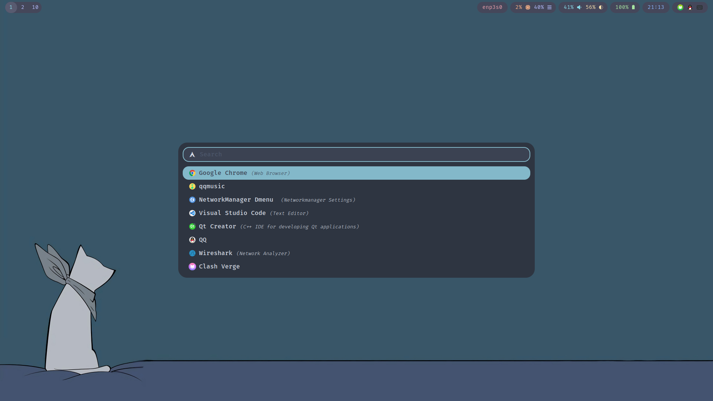
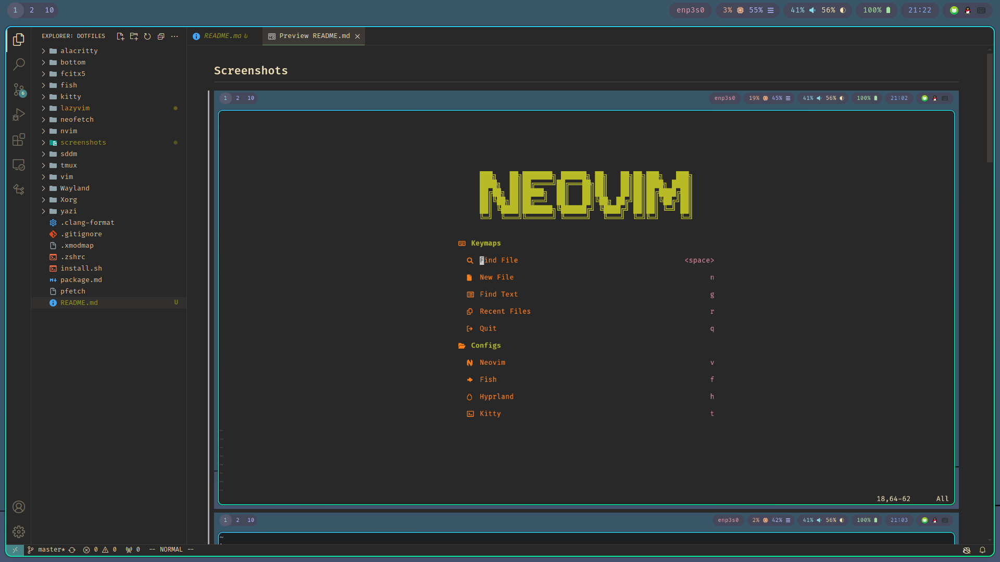

# Packages
## Displayer Manager
sddm

## Fonts
ttf-firacode-nerd adobe-source-han-sans-cn-fonts adobe-source-han-serif-cn-fonts noto-fonts-emoji

## Input Method
fcitx5 fcitx5-qt fcitx5-gtk fcitx5-rime fcitx5-configtool fcitx5-input-support rime-ice

## Audio system
pipewire pipewire-audio pipewire-pulse pavucontrol

## Window Manager - Niri + DMS
dms-shell-niri xdg-desktop-portal-gtk xdg-desktop-portal-gnome polkit-kde-agent xwayland-satellite

## misc
mpv imv grub-customizer

## Terminal Emulator
kitty

## Screenshots

